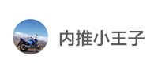
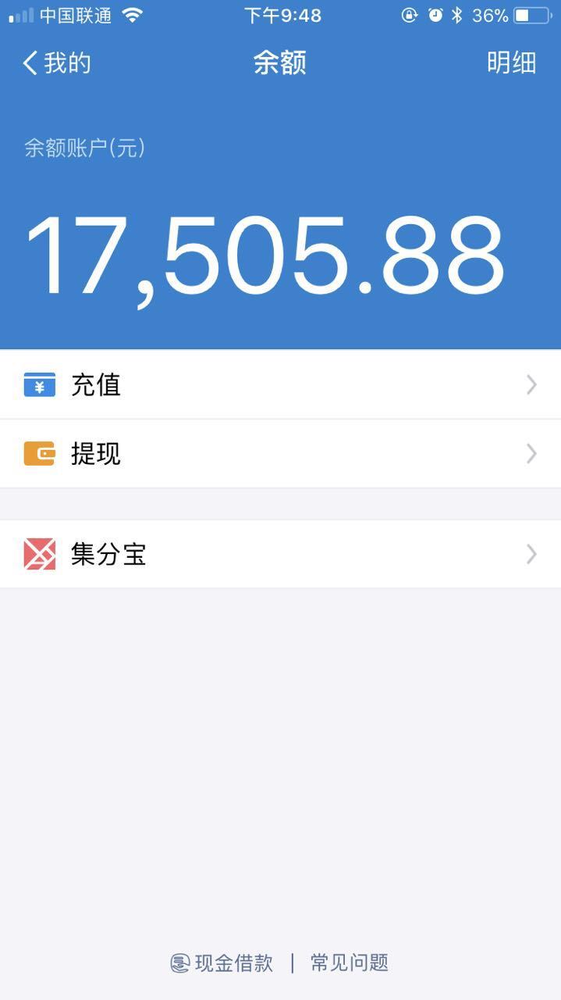

#  NodeParty 开源基金会运作草案 

   

## 组织介绍

**NodeParty 开源基金会**是一个**新型的**、**纯公益性质的**、**开源的**基金会，它用标准严谨的开源流程来管理资金，由社区具有一定影响力的开发者共同监督和维护。

建立此开源基金会的初衷是**利用社区活动或者企业赞助产生的资金，不计回报地回馈给社区。例如支持社区相关活动的支出、支持在社区有突出贡献的个人开发者，以及在社区有贡献的小型初创公司等**。

基金会的资金目前主要有一下两个来源。

1. 相关线下线上活动的门票；
2. 个人和企业的赞助（参考[赞助列表](#赞助列表活动收入挂在讲师名下记录其他赞助个人和企业名义记录)和[赞助流程](#赞助流程)）。

如果您需要得到此基金会的支持，请按照[资金申请流程](#资金申请流程)提交相关资料。另外我们会择机自主赞助个人或者社区活动。

任何个人没有动用本基金会资金的权利，所有支出均需要经过[资金管理流程](#资金管理流程)的制约，由维护者共同监督。

您也可以申请加入此组织，请联系[基金委员会](#基金委员会成员)中至少一位成员，并且通过 3 人以上推荐即可进入维护者列表，拥有监督此基金会所有流程的权利。

## 资金管理流程

### 资金池

此基金的真实资金池，存于一个独立的支付宝账号中，此账号的登录密码，支付密码，绑定手机号由主事持有。

### 流程

#### 资金申请流程

1. 由申请者或者管理员提交 Issue ，标题格式如下：
   > Apply Spending: ${日期} ${事项} ${申请金额}

   例如：**Apply Spending: 20170801 杭州小型聚会餐饮费 200.00 元**，并且在 Issue 详情里提供更为详细的信息。
2. 由[**基金委员会成员**](#基金委员会成员)中 3 人以上在 Issue 里回复 OK。
3. 满足条件后，由**主事**将资金转出，并且将**转账记录**和**余额信息**截图回复到 Issue 中，同时关闭 Issue。
4. **主事**提交支出记录到 [SPENDING.md](SPENDING.md)。

#### 资金收入流程

1. 由主事或管理员提交 Issue，标题格式如下：
   > Apply Income: ${日期} ${事项} ${收入金额}
2. 主事收到钱款之后，将**转账记录**和**余额信息**截图回复到 Issue 中，同时关闭 Issue。
3. 主事提交收入记录到 [INCOMING.md](INCOMING.md)。

### 记录

#### 收入记录

基金的每笔收入都由[基金委员会成员](基金委员会成员)以 Pull Request 的形式提交到 [INCOMING.md](INCOMING.md)，需包含信息：

* 捐赠者
* 金额
* 时间（2017-07-08）
* 收入类型
* 备注

Commit Message 需按照此格式：

> income: ${捐赠者} ${金额} ${捐赠时间} ${收入类型} ${备注}
>
> > 其中收入类型包含：**个人赞助**、**企业赞助**、**活动门票**。
> >
> > 备注中需注明详细信息，例如**某年某月某次活动的门票收入，共多少人报名**。
> >
> > 金额为单位为人民币元，精确到小数点后 2 位。

所有人工收入和自动收入（如利息，利息收入需要有脚本实现自动记录）都须有收入记录。

#### 支出记录

基金的每笔收入都由维护者以 Pull Request 的形式提交到 [SPENDING.md](SPENDING.md)，需包含信息：

* 支出金额
* 支出日期
* 支出事项

Commit Message 需按照此格式：

> spending: ${支出金额} ${支出日期} ${支出事项}

## 赞助

### 赞助流程

1. 赞助方提交 Issue，标题格式如下：
   > Present Donate: ${日期} ${事项} ${赞助金额}

   请在 Issue 里提交联系方式等详细信息。
2. 由[基金委员会](#基金委员会成员)主事或管理员联系赞助方，接受资金转入（专用支付宝账号：[xinyu198736@gmail.com](mailto:xinyu198736@gmail.com)），将截图添加到 Issue，并关闭 Issue。
3. 主事提交收入记录到 [INCOMING.md](INCOMING.md)。
4. 主事将赞助对象添加到赞助列表。可带有 Logo 和链接。

## 赞助列表

| 捐赠者 | 金额(元) | 时间| 收入类型 | Issue |
|--------|----------|-----|----------|------------|
| @Keith-CY | 150.00 | 2017-08-02 | 个人赞助 | [#2](https://github.com/Hangzhou-Node-Party/JS-OpenSource-Foundation/issues/2) |
| @longtianye  | 200.88 | 2017-08-02 | 个人赞助 | [#3](https://github.com/Hangzhou-Node-Party/JS-OpenSource-Foundation/issues/3) |
| @xinyu198736  | 2000.00 | 2017-08-06 | 个人赞助 | [#5](https://github.com/Hangzhou-Node-Party/JS-OpenSource-Foundation/issues/5) |
| @huanglong  | 1024.00 | 2017-08-06 | 个人赞助 | [#6](https://github.com/Hangzhou-Node-Party/JS-OpenSource-Foundation/issues/6) |
| @int64ago  | 100.00 | 2017-08-06 | 个人赞助 | [#7](https://github.com/Hangzhou-Node-Party/JS-OpenSource-Foundation/issues/7) |
| @掘金  | 2000.00 | 2017-08-08 | 企业赞助 | [#8](https://github.com/Hangzhou-Node-Party/JS-OpenSource-Foundation/issues/8) |
| @diysimon  | 200.00 | 2017-08-08 | 个人赞助 | [#13](https://github.com/Hangzhou-Node-Party/JS-OpenSource-Foundation/issues/13) |
| @ECharts  | 666.00 | 2017-08-08 | 开源组织赞助 | [#14](https://github.com/Hangzhou-Node-Party/JS-OpenSource-Foundation/issues/14) |
| @SAN  | 666.00 | 2017-08-08 | 开源组织赞助 | [#15](https://github.com/Hangzhou-Node-Party/JS-OpenSource-Foundation/issues/15) |
| @轻山科技  | 2000.00 | 2017-08-09 | 企业赞助（纯公益） | [#16](https://github.com/Hangzhou-Node-Party/JS-OpenSource-Foundation/issues/16) |
| @100offer  | 3000.00 | 2017-08-09 | 企业赞助 | [#17](https://github.com/Hangzhou-Node-Party/JS-OpenSource-Foundation/issues/17) |
| @TevinLi  | 100.00 | 2017-08-10 | 个人赞助 | [#18](https://github.com/Hangzhou-Node-Party/JS-OpenSource-Foundation/issues/18) |
| @又拍云  | 3000.00 | 2017-08-10 | 企业赞助 | [#19](https://github.com/Hangzhou-Node-Party/JS-OpenSource-Foundation/issues/19) |
| @xiaojue  | 500.00 | 2017-08-10 | 个人赞助 | [#20](https://github.com/Hangzhou-Node-Party/JS-OpenSource-Foundation/issues/20) |
| @5265liu  | 100.00 | 2017-08-10 | 个人赞助 | [#21](https://github.com/Hangzhou-Node-Party/JS-OpenSource-Foundation/issues/21) |
| @内推小王子  | 666.00 | 2017-08-11 | 个人赞助 | [#22](https://github.com/Hangzhou-Node-Party/JS-OpenSource-Foundation/issues/22) |
| @mindb  | 500.00 | 2017-08-11 | 开源赞助 | [#23](https://github.com/Hangzhou-Node-Party/JS-OpenSource-Foundation/issues/23) |
| @王子亭  | 200.00 | 2017-08-14 | 个人赞助 | [#24](https://github.com/Hangzhou-Node-Party/JS-OpenSource-Foundation/issues/24) |
| @老雷  | 233.00 | 2017-08-14 | 个人赞助 | [#25](https://github.com/Hangzhou-Node-Party/JS-OpenSource-Foundation/issues/25) |
| @阴明  | 200.00 | 2017-08-14 | 个人赞助 | [#26](https://github.com/Hangzhou-Node-Party/JS-OpenSource-Foundation/issues/26) |

感谢以下个人的赞助：

感谢以下企业的赞助：

感谢以下开源组织或个人组织的赞助：

> 活动收入挂在讲师名下记录，其他赞助个人和企业名义记录。

## 基金委员会成员

* [芋头](https://github.com/xinyu198736)（主事）- @xinyu198736 &lt;xinyu198736@gmail.com>
* [死月](https://github.com/XadillaX)（管理员）- @XadillaX &lt;i@2333.moe>
* [小问](https://github.com/iwillwen)（管理员）- @iwillwen &lt;willwengunn@gmail.com>
* [闪总](https://github.com/ShiningRay)（管理员）- @ShiningRay &lt;tsowly@hotmail.com>
* [江昪](https://github.com/glowin)（管理员）- @Glow Chiang &lt;jiangbian66@gmail.com>

## 当前资金池

<!-- money start -->
| 款项 | 金额 |
|------|------|
| **总额** | 17505.88 元 |
| **本月收入** | 17505.88 元 |
| **待入账** | 2430.00 元 |
| **本月支出** | 0 元 |
<!-- money end -->

### 余额截图

